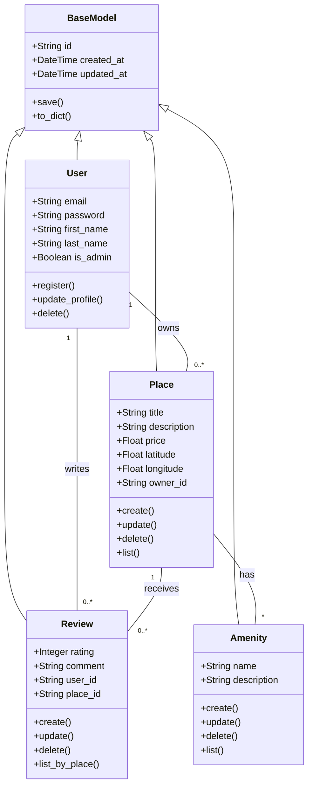

# Part 1: Technical Documentation

## Table of Contents
1. [Description](#description)
2. [System Architecture](#system-architecture)
3. [Class Diagram](#class-diagram)
4. [Explanatory Notes](#explanatory-notes)
5. [Author](#author)

## Description
The **Class Diagram** is a static structure diagram in UML that describes the structure of a system by showing the system's classes, their attributes, operations (or methods), and the relationships among objects. For the **HBnB Evolution** project, this diagram serves as the blueprint for the Business Logic Layer, mapping out the core entities like Users, Places, Reviews, and Amenities, and enforcing the architectural rules before implementation begins. It ensures that data structures are strictly defined and relationships are logically sound.

## System Architecture
The Class Diagram focuses specifically on the **Business Logic Layer**, which sits between the Presentation and Persistence layers:

1. **BaseModel Abstraction**: Acts as the parent for all entities, enforcing a standard structure (UUIDs, timestamps) across the entire system.
2. **Core Entities (User, Place, etc.)**: These classes encapsulate the business data and rules. They define *what* data allows the application to function (e.g., a Place must have an owner).
3. **Entity Relationships**: Defines how data connects, such as a "User" owning a "Place" or a "Place" having "Amenities".

## Class Diagram
**Tool used:** Mermaid.js

## Explanatory Notes

### Key Entities Breakdown
* **BaseModel**: The foundation class. It prevents code redundancy by managing unique IDs (UUID4) and audit timestamps (created_at, updated_at) for every single object in the system.
* **User**: Represents the actor in the system. Security attributes like password and roles (is_admin) are defined here.
* **Place**: The central entity of the application. It links to almost all other entities (Owner, Reviews, Amenities).

### Relationships Logic
* **Inheritance (<|--):** All entities inherit from BaseModel. This guarantees that if we need to change how IDs are generated, we only change it in one place.
* **Composition & Associations:**
    * **User ↔ Place (1-to-Many):** A strict ownership rule. A place cannot exist without an owner, but a user can exist without places.
    * **Place ↔ Amenity (Many-to-Many):** This relationship allows flexibility. A specific "WiFi" amenity object can be linked to thousands of different places efficiently.

## Author
**Mohammed Aloufi** - [GitHub Profile Link](https://github.com/MohammedError)
