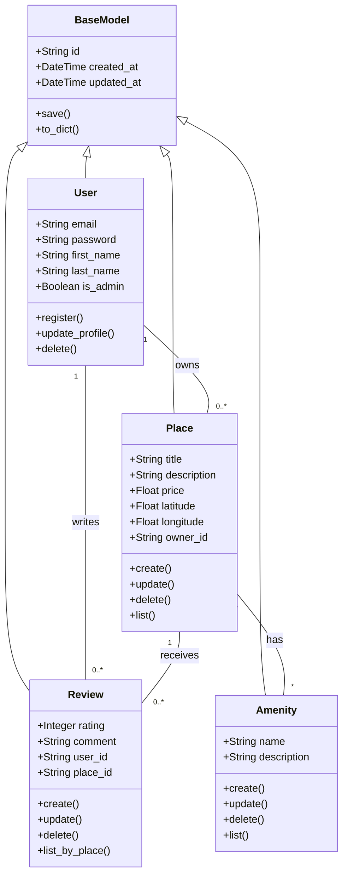

#  Detailed Class Diagram for Business Logic Layer

##  Contents
1. [Class Diagram](#class-diagram)
2. [Explanatory Notes](#explanatory-notes)
3.  [Author)

## Class Diagram
**Tool used:** Mermaid.js

## Explanatory Notes

### Key Entities Breakdown
* **BaseModel**: The foundation class. It prevents code redundancy by managing unique IDs (UUID4) and audit timestamps (created_at, updated_at) for every single object in the system.
* **User**: Represents the actor in the system. Security attributes like password and roles (is_admin) are defined here.
* **Place**: The central entity of the application. It links to almost all other entities (Owner, Reviews, Amenities).

### Relationships Logic
* **Inheritance (<|--):** All entities inherit from BaseModel. This guarantees that if we need to change how IDs are generated, we only change it in one place.
* **Composition & Associations:**
    * **User ↔ Place (1-to-Many):** A strict ownership rule. A place cannot exist without an owner, but a user can exist without places.
    * **Place ↔ Amenity (Many-to-Many):** This relationship allows flexibility. A specific "WiFi" amenity object can be linked to thousands of different places efficiently.

## Author
**Mohammed Aloufi** 
