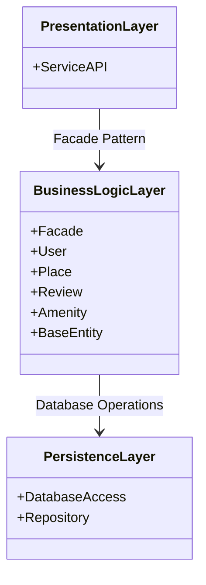

**High-Level Package Diagram for HBnB Application**

## Table of Contents
- [1. Overview](#1-Overview)
- [2. Layers and Components](#2-layers-and-components)
- [3. Communication (Facade Pattern)](#3-communication-facade-pattern)
- [4. Diagram](#4-diagram)
- [5. Explanatory Notes](#5-explanatory-notes)

---

## 1. **Overview**
The goal of this task is to create a **high-level package diagram** that illustrates the three-layer architecture of the HBnB application and shows how these layers interact using the **Facade Pattern**.  
This diagram provides a conceptual overview of how the main components of the application are organized and communicate with each other.

---
## 2. **Layers and Components**

| Layer | Components | Responsibilities |
|-------|------------|-----------------|
| **Presentation Layer** | Service APIs, Endpoints | Handles user requests and responses. Does not contain business logic or direct database access. |
| **Business Logic Layer** | Facade, Models (User, Place, Review, Amenity, BaseEntity) | Core business logic, validation, and coordination between layers. The Facade provides a simplified interface for the Presentation Layer. |
| **Persistence Layer** | Database, Repository / Storage | Handles data storage and retrieval (CRUD operations). No direct interaction with the Presentation Layer. |

---

## **3. Communication (Facade Pattern)**
- **Presentation → Business Logic:**  
  The Presentation Layer communicates **only through the Facade**, avoiding direct interaction with the Models.
- **Business Logic → Persistence:**  
  Handles data storage and retrieval operations directly.
- **Presentation Layer** does not communicate directly with the Persistence Layer.

---

## **4. Diagram**
 (Mermaid.js)

---

## **Facade Pattern Explanation**
The **Facade Pattern** is used to streamline interactions between layers:
- The **Presentation Layer** does not directly access database logic; instead, it communicates through the **Facade** in the **Business Logic Layer**.
- The **Facade** provides a simplified interface to interact with the models, ensuring separation of concerns.
- The **Persistence Layer** remains hidden behind the Business Logic Layer, ensuring direct database interactions are encapsulated.

---

## **5. Explanatory Notes**

- Presentation Layer: Provides the interface for users to interact with the system; it does not implement business logic.

- Business Logic Layer: Contains the system's core functionality and rules; the Facade simplifies interaction with Models and Persistence.

- Persistence Layer: Responsible for storing and retrieving data; it is not exposed to the Presentation Layer.

- Facade Pattern: Hides the internal complexity of the Business Logic Layer and provides a unified, simple interface. This reduces coupling and improves maintainability.

