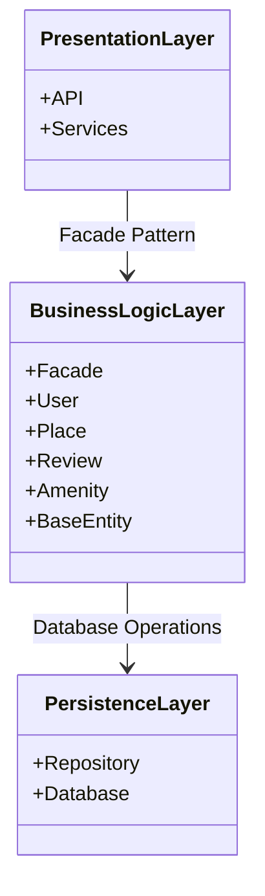

# **High-Level Package Diagram for HBnB Application**

## Contents
- [Diagrams](#diagrams)
- [Explanatory Notes](#explanatory-notes)
- [Author](#author)
---

## **Diagram**
 (Mermaid.js)

(drawio.png)

---

## **Explanatory Notes**

- Presentation Layer: Provides the interface for users to interact with the system, it does not implement business logic.

- Business Logic Layer: Contains the system's core functionality and rules, the Facade simplifies interaction with Models and Persistence.

- Persistence Layer: Responsible for storing and retrieving data, it is not exposed to the Presentation Layer.

- Facade Pattern: Hides the internal complexity of the Business Logic Layer and provides a unified, simple interface. This reduces coupling and improves maintainability.

---

## **Author**

**Layla Alshehri** - [GitHub](https://github.com/Laja99)