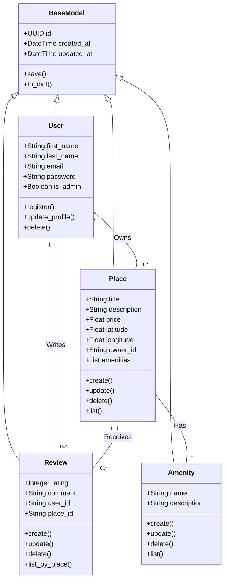

# HBnB - UML Documentation

## Contents
- [Introduction](#introduction)
- [1. High-Level Architecture](#1-high-level-architecture)
- [2. Business Logic Layer](#2-business-logic-layer)
- [3. API Interaction Flow](#3-api-interaction-flow)
- [Authors](#authors)

## Introduction

        The HBnB project is a simplified property rental platform inspired by modern accommodation booking systems. The system allows users to create and manage accounts, list properties, submit reviews, and associate amenities with places. It is designed to demonstrate real-world software engineering concepts such as layered architecture, API-driven communication, and object-oriented design.

        The purpose of this technical document is to define the architecture and design of the HBnB system and to serve as a reference during the implementation phase. It helps developers understand how system components interact, how business rules are applied, and how data flows across the application, ensuring consistency and alignment with project requirements.

        This document covers the system architecture, core business entities, and API interaction flows using UML diagrams. It includes high-level architecture diagrams, class diagrams, and sequence diagrams that provide a clear blueprint of the system before development begins.

## 1. High-Level Architecture

**1.1 High-Level Package Diagram**

**1.2 Explanatory Notes**
**1.2.1 Purpose of the Diagram**

This package diagram provides a **high-level visual representation** of the HBnB Evolution application's three-layer architecture. It serves multiple purposes:

- **Architectural Visualization:** Clearly illustrates the separation of concerns between presentation, business logic, and persistence layers

- **Communication Flow:** Demonstrates how data and requests move through the system using the Facade Pattern

- **Component Organization:** Shows how related classes are grouped into packages for better maintainability

- **Design Pattern Implementation:** Highlights the use of Facade Pattern to simplify complex subsystem interactions

- **Onboarding Tool:** Helps new developers understand the system structure without diving into code

    The diagram acts as a **living documentation** that bridges the gap between conceptual design and actual implementation.

**1.2.2 Key Components and Classes**

| Layer | Components | Responsibilities |
|-------|------------|-----------------|
| **Presentation Layer** | Services, APIs Endpoints | Handles user requests and responses. Does not contain business logic or direct database access. |
| **Business Logic Layer** | Facade, Models (User, Place, Review, Amenity, BaseModel) | Core business logic, validation, and coordination between layers. The Facade provides a simplified interface for the Presentation Layer. |
| **Persistence Layer** | Database, Repository / Storage | Handles data storage and retrieval (CRUD operations). No direct interaction with the Presentation Layer. |

**1.2.3 Connections Between Layers**
1. **Presentation Layer → Business Logic Layer**

    Connection: API/Services → Facade
    
    Type: Service Invocation / Method Call
    
    Purpose: Presentation layer calls facade methods to execute business operations
    
    Example: facade.registerUser(userData)

2. **Business Logic Layer Internal**

    Connection: Facade → Models

    Type: Business Logic Execution

    Purpose: Facade creates and manipulates domain entities (User, Place, etc.)

    Example: User user = new User(data)

3. **Business Logic Layer → Persistence Layer**

    Connection: Models → Repositories

    Type: Data Persistence / CRUD Operations

    Purpose: Entities save/load data through repositories

    Example: userRepository.save(user)

4. **Persistence Layer → Database**

    Connection: Repositories → Database

    Type: Database Operations / SQL Execution

    Purpose: Repositories execute SQL queries on the database

    Example: INSERT INTO users (...) VALUES (...)

**1.2.4 Design Decisions**

- Three-Layer Architecture: Separates UI, business rules, and data for maintainability and independent development.

- Facade Pattern: Single entry point (Facade) simplifies client interaction and hides internal complexity.

- Repository Pattern: Abstracts database access, enabling easy switching between databases and better testing.

- Domain Models: Business logic resides in entities (User, Place, etc.), keeping it centralized and organized.

**1.2.5 Architecture Integration**

This diagram represents the core structure of HBnB:

- Flow:

    Client → Presentation (API/Services) → Business Logic (Facade → Models) → Persistence (Repositories → Database)

- Role in Overall System:

    Foundation for all features (user mgmt, place listing, reviews)

    Ensures clean separation for scalability

    Follows proven enterprise patterns

    Enables parallel team work on different layers

## 2. Business Logic Layer
**Tool used:** Mermaid.js

### 2.1 Explanatory Notes

**2.1.1 Purpose of the Diagram**

The Class Diagram above illustrates the **static structure** of the Business Logic Layer. It defines the core entities (classes) of the HBnB application, their attributes, methods, and the relationships between them. This diagram serves as the blueprint for the object-oriented design, ensuring that data is organized logically before being processed by the application or stored in the database.

**2.1.2 Key Entities and Responsibilities**

| Class | Role & Responsibilities |
|-------|-------------------------|
| **BaseModel** | The parent class for all other entities. It manages common attributes like unique identifiers (`id`) and timestamps (`created_at`, `updated_at`). It also provides standard methods for serialization (`to_dict`) and persistence (`save`). |
| **User** | Represents the system's users. Handles authentication data (email, password), profile information, and administrative privileges (`is_admin`). |
| **Place** | The core entity of the platform. Contains details about the rental property (title, price, location) and links to the owner and amenities. |
| **Review** | Stores feedback provided by users for specific places. It links the `User` who wrote it and the `Place` being reviewed. |
| **Amenity** | Represents features available at a property (e.g., Wifi, Pool). It allows for better categorization and filtering of places. |

**2.1.3 Relationships and Inheritance**

1.  **Inheritance (`<|--`)**:
    * **Structure:** `User`, `Place`, `Review`, and `Amenity` all inherit from `BaseModel`.
    * **Reason:** This ensures that every object in the system automatically has a unique UUID and timestamps without rewriting code.

2.  **Associations**:
    * **User ↔ Place (1 to 0..*):** A single User can own multiple Places (or none), but a Place is owned by exactly one User.
    * **User ↔ Review (1 to 0..*):** A User can write many Reviews.
    * **Place ↔ Review (1 to 0..*):** A Place can receive multiple Reviews.
    * **Place ↔ Amenity (* to *):** A Place can have many Amenities, and an Amenity can belong to many Places (Many-to-Many relationship).

**2.1.4 Design Decisions**

* **Utilization of UUIDs:** Instead of simple integer IDs, we use UUIDs (Universally Unique Identifiers) in the `BaseModel`. This ensures unique identification across distributed systems and improves security by making IDs non-guessable.
* **Separation of Concerns:** Each class is responsible for its own data integrity. For example, the `User` class handles user-specific logic, while the `Place` class manages property details.
* **Serialization Support:** The `to_dict()` method in `BaseModel` is crucial for the API layer. It allows instances to be easily converted into JSON format for HTTP responses.
 ## 3. API Interaction Flow

**3.1. User Registration:**  

**3.1.1. Data Flow and Interactions:**

1- User → Browser:  
New user enters registration data (username, email, password).

2- Browser → API Layer:  
Sends `POST /register` request.

3- API → Validation/Business Logic:  
Checks for required fields, password complexity, and whether the user already exists.

4- Business Logic → Database:  
If validation passes, the new user is persisted.

5- Database → Business Logic → API → Browser → User:  
Confirmation (account created) or error (user exists) returns to the user.

**3.1.2. Explanatory Notes**

1- Purpose of the Diagram:  

It describes how new users register and how the system prevents duplicate accounts.

2- Key Components Involved:
- User
- Browser
- Presentation Layer (API)
- Auth / Validation Logic
- Business Logic
- Persistence Layer (Database)

3- Design Decisions and Rationale:  
- Input validation occurs before database interaction.
- Duplicate user checking prevents data conflicts.
- Uses ALT flow for existing vs new users.

4- How It Fits into Overall Architecture:  

It represents the entry point to the system, ensuring only valid and unique users are created.

**3.2. Place Creation:**  

**3.2.1. Data Flow and Interactions:**

1- User → Browser:  
User submits a form with new place details.

2- Browser → API Layer:  
Sends a `POST /places` request with JSON payload.

3- API → Authentication Service:  
Before processing, API validates the JWT token to ensure the user is authenticated.

4- API → Business Logic Layer:  
Once authenticated, the data is sent to business logic. Here, the system validates fields (e.g., name, location, price).

5- Business Logic → Database:  
Valid data is persisted into the database.

6- Database → Business Logic → API → Browser → User:  
Confirmation of creation (success/failure) flows back up the chain, informing the user.

**3.2.2. Explanatory Notes**

1- Purpose of the Diagram:  

It shows how a new place listing is created in the system, including authentication, validation, and database persistence.

2- Key Components Involved:
- User
- Browser
- Presentation Layer (API)
- Authentication Service (Auth)
- Business Logic
- Persistence Layer (DB)

3- Design Decisions and Rationale:  

- JWT validation ensures only authenticated users can create places.
- Business layer validates place data before saving.
- Database layer is isolated for data integrity and security.

4- How It Fits into Overall Architecture:  

It represents a write operation and highlights secure resource creation using authentication and validation layers.

**3.3. Review Submission:**  

**3.3.1. Data Flow and Interactions:**

1- User → Browser:  
User writes a review for a place.

2- Browser → API Layer:  
Sends `POST /reviews` request.

3- API → Auth Service:  
API checks if user is authenticated (ALT flow logic: authenticated vs unauthenticated).

4- API → Business Logic:  
If authenticated, business logic validates that the place exists and the review data is correct.

5- Business Logic → Database:  
Review is inserted into the database.

6- Database → Business Logic → API → Browser → User:  
Success message or error returns to the user.

**3.3.2. Explanatory Notes**

1- Purpose of the Diagram:  

It explains how users submit reviews while handling authentication scenarios (authenticated vs unauthenticated users).

2- Key Components Involved:
- User
- Browser
- Presentation Layer (API)
- Auth Service
- Business Logic
- persistence Layer (DB)

3- Design Decisions and Rationale:  

- Uses ALT fragment logic to handle authentication states.
- Prevents unauthorized review submissions.
- Business logic verifies place existence before saving review.

4- How It Fits into Overall Architecture:  

It supports data integrity and security enforcement, ensuring reviews are linked to valid users and places.

**3.4. Fetching a List of Places:**  

**3.4.1. Data Flow and Interactions:**

1- User → Browser:  
The user inputs search criteria (e.g., city = Riyadh) in the UI. This data is packaged in an HTTP request.

2- Browser → API (Presentation Layer):  
The browser sends the request to the API endpoint (`GET /places`). The API acts as a mediator, receiving the request and parsing parameters.

3- API → Business Logic Layer:  
The API forwards the parsed filters to the business logic, which prepares a query. The business logic may apply additional filtering or validation to avoid sending unsafe queries directly to the database.

4- Business Logic → Database (Persistence Layer):  
The query is executed against the database, fetching matching places.

5- Database → Business Logic → API → Browser → User:  
Results flow back up the stack: the database returns the data to the business logic, which may format it; the API sends it as an HTTP response to the browser; finally, the user sees the list.

**3.4.2. Explanatory Notes**

1- Purpose of the Diagram:  

It illustrates how the system retrieves a filtered list of places based on user search criteria (e.g., city = Riyadh). It demonstrates the read operation flow from the user interface down to the database and back.

2- Key Components Involved:
- User
- Browser
- Presentation Layer (API)
- Business Logic
- Persistence Layer (DB)

3- Design Decisions and Rationale:  

- Layer separation ensures maintainability and scalability.
- Business logic handles filtering to avoid database coupling with UI.
- API acts as the contract between frontend and backend.

4- How It Fits into Overall Architecture:  

It represents a read/query operation and demonstrates how the layered architecture supports safe and scalable data retrieval.

 ## Authors
 **Layla AlShehri**  
 **Mohammed AlOufi**  
 **Fai AlSharekh**
