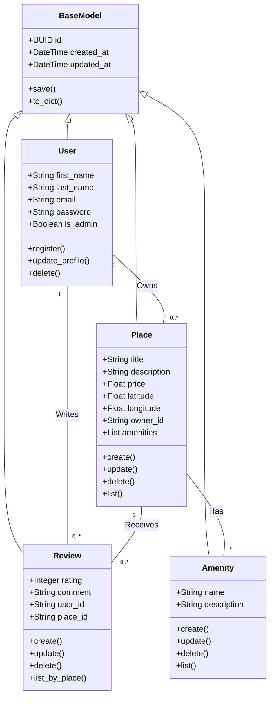

# HBnB - UML Documentation

## Contents
- [Introduction](#introduction)
- [High-Level Architecture](#high-level-architecture)
- [Business Logic Layer](#business-logic-layer)
- [API Interaction Flow](#api-interaction-flow)
- [Authors](#authors)

## Introduction

        The HBnB project is a simplified property rental platform inspired by modern accommodation booking systems. The system allows users to create and manage accounts, list properties, submit reviews, and associate amenities with places. It is designed to demonstrate real-world software engineering concepts such as layered architecture, API-driven communication, and object-oriented design.

        The purpose of this technical document is to define the architecture and design of the HBnB system and to serve as a reference during the implementation phase. It helps developers understand how system components interact, how business rules are applied, and how data flows across the application, ensuring consistency and alignment with project requirements.

        This document covers the system architecture, core business entities, and API interaction flows using UML diagrams. It includes high-level architecture diagrams, class diagrams, and sequence diagrams that provide a clear blueprint of the system before development begins.

## High-Level Architecture

## Business Logic Layer
**Tool used:** Mermaid.js

 ## API Interaction Flow

 ## Authors
 **Layla AlShehri**  
 **Mohammed AlOufi**  
 **Fai AlSharekh**