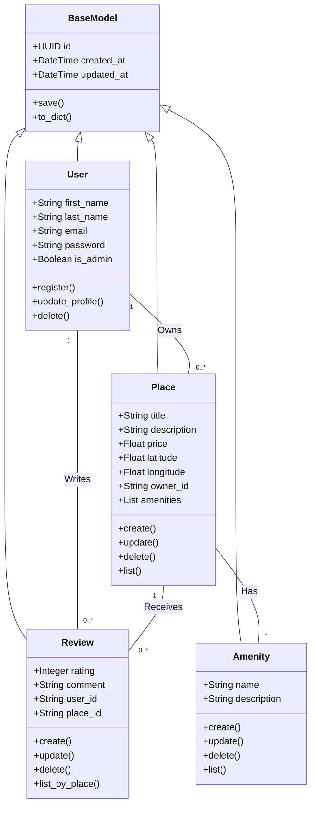

# HBnB - UML Documentation

## Contents
- [Introduction](#introduction)
- [1. High-Level Architecture](#1-high-level-architecture)
- [2. Business Logic Layer](#2-business-logic-layer)
- [3. API Interaction Flow](#3-api-interaction-flow)
- [Authors](#authors)

## Introduction

        The HBnB project is a simplified property rental platform inspired by modern accommodation booking systems. The system allows users to create and manage accounts, list properties, submit reviews, and associate amenities with places. It is designed to demonstrate real-world software engineering concepts such as layered architecture, API-driven communication, and object-oriented design.

        The purpose of this technical document is to define the architecture and design of the HBnB system and to serve as a reference during the implementation phase. It helps developers understand how system components interact, how business rules are applied, and how data flows across the application, ensuring consistency and alignment with project requirements.

        This document covers the system architecture, core business entities, and API interaction flows using UML diagrams. It includes high-level architecture diagrams, class diagrams, and sequence diagrams that provide a clear blueprint of the system before development begins.

## 1. High-Level Architecture

## 2. Business Logic Layer
**Tool used:** Mermaid.js

 ## 3. API Interaction Flow

**3.1. User Registration:**  

**3.1.1. Data Flow and Interactions:**

1- User → Browser:  
New user enters registration data (username, email, password).

2- Browser → API Layer:  
Sends `POST /register` request.

3- API → Validation/Business Logic:  
Checks for required fields, password complexity, and whether the user already exists.

4- Business Logic → Database:  
If validation passes, the new user is persisted.

5- Database → Business Logic → API → Browser → User:  
Confirmation (account created) or error (user exists) returns to the user.

**3.1.2. Explanatory Notes**

1- Purpose of the Diagram:  

This diagram describes how new users register and how the system prevents duplicate accounts.

2- Key Components Involved:
- User
- Browser
- API Layer
- Auth / Validation Logic
- Business Logic
- Database Layer

3- Design Decisions and Rationale:  

- Input validation occurs before database interaction.
- Duplicate user checking prevents data conflicts.
- Uses ALT flow for existing vs new users.

4- How It Fits into Overall Architecture:  

This diagram represents the entry point to the system, ensuring only valid and unique users are created.

 ## Authors
 **Layla AlShehri**  
 **Mohammed AlOufi**  
 **Fai AlSharekh**